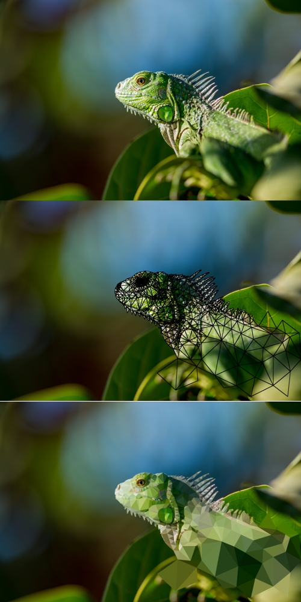

# Polygons

Colour 2D meshes using the average colour from an image.

## Usage

`polygons.py [-h] [-s [STROKE]] [-f SCALE] [-r] [-o OUTPUT] [-O] svg image`

### Positional Arguments
* `svg` - The svg mesh to colourize.
* `image` - The image file to read.

### Optional Arguments
* `-h`, `--help` - show the help message and exit
* `-s [STROKE]`, `--stroke [STROKE]` -  Stroke the polygons instead of colouring them. Takes either a width, 'perimeter' or 'pixels'. Default is 1.
* `-f SCALE`, `--scale-factor SCALE` - A scale factor for the polygon scan area. Values > 1 will scan a larger area, values < 1 will scan a smaller area. Default is 1.
* `-r`, `--resize` - Resize the output polygons to match the scan area.
* `-o OUTPUT`, `--output OUTPUT` - Specify an output file. The default is the input file + '- colourized'.
* `-O`, `--overwrite` - Overwrite the input svg.
